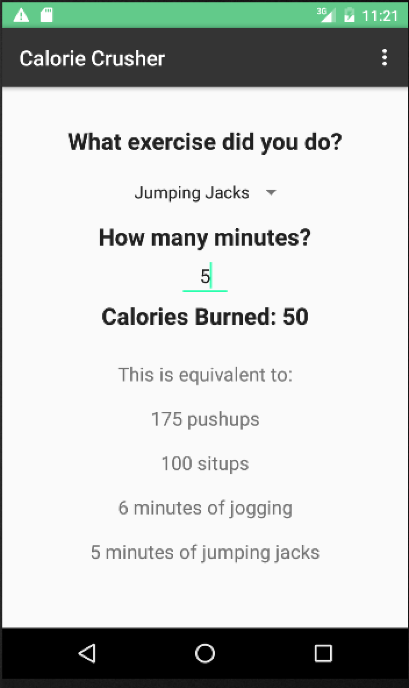

# PROG 01: Crunch Time

Calorie Crusher is an app for Android that takes in several different exercises and computes the amount of calories burned by each one with a given quantity.
Additionaly it converts the amount of calories burned between all of the exercises listed.

## Authors

Jacobo Sternberg ([j.sternberg@berkeley.edu](mailto:j.sternberg@berkeley.edu))

## Demo Video

See Calorie Crusher (https://youtu.be/5pborELrBIo)

## Screenshots

## Acknowledgments

Thanks to all the helpful stack overflow people, and some youtube tutorials.
